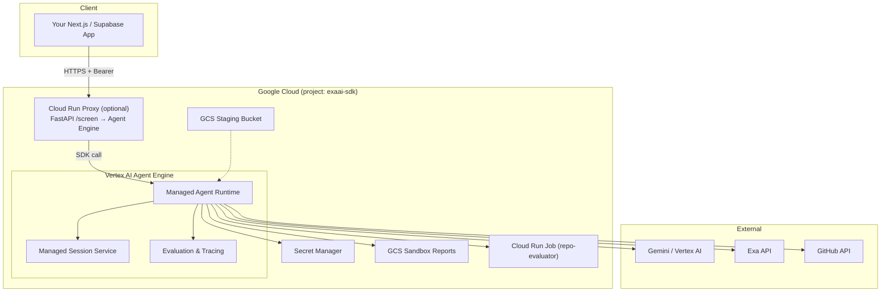

# Deploying EXAai-ADK on Vertex AI Agent Engine (Agent Runtime)

> [!IMPORTANT]
> This guide covers deploying the resume screening agent to **Vertex AI Agent Engine** (formerly Agent Engine, now part of Agent Runtime) — Google's fully managed platform for ADK agents. This is a different path from the Cloud Run containerized deployment covered in `deploy_path.md`.

---

## Agent Engine vs Cloud Run — When to Use Which


| Factor               | Agent Engine (this guide)         | Cloud Run (deploy_path.md)            |
| -------------------- | --------------------------------- | ------------------------------------- |
| **Infra management** | Fully managed by Google           | You manage containers, scaling        |
| **Scaling**          | Automatic (zero-config)           | Manual config (`--min/max-instances`) |
| **Session/state**    | Built-in managed sessions         | In-memory (you implement persistence) |
| **Deployment**       | `adk deploy` one-liner            | Docker build → push → deploy          |
| **Custom HTTP API**  | gRPC/SDK-based invocation         | Full control (FastAPI `/screen`)      |
| **Observability**    | Built-in eval + tracing           | Cloud Logging + custom setup          |
| **Cost model**       | vCPU-hours + GB-hours + LLM calls | Cloud Run per-request pricing         |
| **Best for**         | Pure ADK agent workloads          | Custom HTTP APIs with middleware      |


> [!NOTE]
> Your project has a rich FastAPI layer (`api/` — auth, middleware, multipart upload, health checks). Agent Engine doesn't expose custom HTTP routes. **Recommended approach:** deploy the ADK agent to Agent Engine and keep a thin Cloud Run proxy for your existing `/screen` API. Both options are covered below.

---

## Architecture Overview




---

## Step-by-Step Deployment

### 1. Prerequisites

```bash
# Authenticate
gcloud auth login
gcloud auth application-default login
gcloud config set project exaai-sdk

# Enable required APIs
gcloud services enable \
  aiplatform.googleapis.com \
  secretmanager.googleapis.com \
  storage.googleapis.com \
  run.googleapis.com \
  cloudbuild.googleapis.com

# Create staging bucket for Agent Engine deployment artifacts
gcloud storage buckets create gs://exaai-sdk-agent-staging \
  --location=asia-south1 \
  --uniform-bucket-level-access \
  --public-access-prevention
```

---

### 2. IAM Setup

```bash
# The Agent Engine uses a Google-managed service agent, but your code
# needs a custom SA for accessing secrets, GCS, and sandbox jobs.

SA_EMAIL="exaai-adk-runner@exaai-sdk.iam.gserviceaccount.com"

# If not already created (from Cloud Run guide):
gcloud iam service-accounts create exaai-adk-runner \
  --display-name="EXAai-ADK Agent Engine Service"

# Required roles
for ROLE in \
  roles/secretmanager.secretAccessor \
  roles/aiplatform.user \
  roles/storage.objectUser \
  roles/run.developer \
  roles/logging.logWriter; do
  gcloud projects add-iam-policy-binding exaai-sdk \
    --member="serviceAccount:$SA_EMAIL" \
    --role="$ROLE"
done
```

---

### 3. Store Secrets in Secret Manager

Same as the Cloud Run guide — all API keys must live in Secret Manager:

```bash
# Create secrets (skip if already created from deploy_path.md)
echo -n "your-gemini-api-key"      | gcloud secrets create GEMINI_API_KEY --data-file=-
echo -n "your-exa-api-key"         | gcloud secrets create EXA_API_KEY --data-file=-
echo -n "your-github-token"        | gcloud secrets create GITHUB_TOKEN --data-file=-
echo -n "your-groq-api-key"        | gcloud secrets create GROQ_API_KEY --data-file=-
echo -n "your-openrouter-api-key"  | gcloud secrets create OPEN_ROUTER_API_KEY --data-file=-

API_KEY=$(openssl rand -base64 32)
echo -n "$API_KEY" | gcloud secrets create API_KEYS --data-file=-
echo "Client API key: $API_KEY"
```

---

### 4. Create the Agent Engine Wrapper Module

Agent Engine expects an `AdkApp`-wrapped agent. Create a thin wrapper that bridges your existing `create_screening_agent()` with the Agent Engine runtime.

Create `agent/engine_app.py`:

```python
"""Vertex AI Agent Engine entry point.

This module wraps the existing screening agent in an AdkApp
for deployment to Agent Engine (Agent Runtime).
"""

from __future__ import annotations

import os
import logging

logger = logging.getLogger("exaai_adk.engine_app")


def _load_secrets_from_secret_manager() -> None:
    """Fetch API keys from Secret Manager and inject into os.environ.

    Agent Engine doesn't support --set-secrets like Cloud Run,
    so we pull secrets at startup via the Python client.
    """
    try:
        from google.cloud import secretmanager

        client = secretmanager.SecretManagerServiceClient()
        project_id = os.environ.get("GCP_PROJECT_ID", "exaai-sdk")

        secret_env_map = {
            "GEMINI_API_KEY": "GEMINI_API_KEY",
            "EXA_API_KEY": "EXA_API_KEY",
            "GITHUB_TOKEN": "GITHUB_TOKEN",
            "GROQ_API_KEY": "GROQ_API_KEY",
            "OPEN_ROUTER_API_KEY": "OPEN_ROUTER_API_KEY",
            "API_KEYS": "API_KEYS",
        }

        for secret_id, env_var in secret_env_map.items():
            if os.environ.get(env_var):
                continue  # Already set, don't override
            try:
                name = f"projects/{project_id}/secrets/{secret_id}/versions/latest"
                response = client.access_secret_version(request={"name": name})
                os.environ[env_var] = response.payload.data.decode("UTF-8")
                logger.info("Loaded secret %s from Secret Manager", secret_id)
            except Exception as exc:
                logger.warning("Could not load secret %s: %s", secret_id, exc)

    except ImportError:
        logger.warning("google-cloud-secret-manager not installed; skipping secret loading")


def create_app():
    """Create and return the AdkApp for Agent Engine deployment.

    This function is called by the Agent Engine runtime at startup.
    """
    from vertexai.preview.reasoning_engines import AdkApp

    # Load secrets before creating the agent (needs API keys)
    _load_secrets_from_secret_manager()

    # Set defaults for Agent Engine environment
    os.environ.setdefault("GEMINI_USE_VERTEXAI", "true")
    os.environ.setdefault("GCP_PROJECT_ID", "exaai-sdk")
    os.environ.setdefault("GCP_REGION", "asia-south1")
    os.environ.setdefault("SCREENING_MODE", "agent")
    os.environ.setdefault("LLM_PROVIDER", "auto")
    os.environ.setdefault("SANDBOX_PROVIDER", "cloud_run")
    os.environ.setdefault("LOG_FORMAT", "json")

    from agent.pipeline import create_screening_agent

    agent = create_screening_agent()

    app = AdkApp(
        agent=agent,
        enable_tracing=True,
    )

    return app


# Module-level app instance for Agent Engine to discover
app = create_app()
```

---

### 5. Create `requirements.txt` for Agent Engine

Agent Engine uses `requirements.txt` (not `pyproject.toml`) to install dependencies. Generate one from your existing config:

```bash
# From project root
cat > requirements.txt << 'EOF'
google-adk[extensions]>=1.0.0
google-cloud-aiplatform>=1.70.0
google-cloud-secret-manager>=2.20.0
litellm>=1.71.2
google-generativeai>=0.8.0
fastapi>=0.115.0
uvicorn[standard]>=0.32.0
pdfplumber>=0.11.0
python-docx>=1.1.0
presidio-analyzer>=2.2.0
presidio-anonymizer>=2.2.0
spacy>=3.7.5
exa-py>=1.0.0
jsonschema>=4.23.0
pydantic>=2.9.0
pydantic-settings>=2.6.0
httpx>=0.27.0
google-auth>=2.35.0
google-cloud-storage>=2.18.0
python-multipart>=0.0.12
tree-sitter>=0.21.3
tree-sitter-language-pack
EOF
```

> [!WARNING]
> The spaCy model `en_core_web_sm` needs a post-install step. Add a setup script or include it as a direct dependency:
>
> ```
> # Append to requirements.txt
> https://github.com/explosion/spacy-models/releases/download/en_core_web_sm-3.7.1/en_core_web_sm-3.7.1-py3-none-any.whl
> ```

---

### 6. Deploy via ADK CLI

#### Option A: `adk deploy agent_engine` (Recommended)

```bash
# Install ADK CLI if not already installed
pip install google-adk

# Deploy to Agent Engine
adk deploy agent_engine \
  --project=exaai-sdk \
  --region=asia-south1 \
  --display_name="EXAai Resume Screener" \
  --staging_bucket=gs://exaai-sdk-agent-staging \
  --requirements_file=requirements.txt \
  ./agent/
```

> [!NOTE]
> The `adk deploy` command:
>
> 1. Packages your `agent/` directory as a compressed archive
> 2. Uploads it to the staging bucket
> 3. Creates a Vertex AI ReasoningEngine resource
> 4. Returns a **resource name** like `projects/exaai-sdk/locations/asia-south1/reasoningEngines/1234567890`
>
> Save this resource name — you'll need it to query the agent.

#### Option B: Python SDK (Programmatic)

```python
"""deploy_to_agent_engine.py — deploy via Python SDK."""

import vertexai
from vertexai.preview import reasoning_engines

vertexai.init(project="exaai-sdk", location="asia-south1")

# Read requirements
with open("requirements.txt") as f:
    requirements = [line.strip() for line in f if line.strip() and not line.startswith("#")]

remote_agent = reasoning_engines.ReasoningEngine.create(
    reasoning_engines.AdkApp(
        agent=None,  # Will be created from source
        enable_tracing=True,
    ),
    requirements=requirements,
    display_name="EXAai Resume Screener",
    description="AI-powered resume screening with Exa enrichment and Gemini scoring",
    extra_packages=[
        "./agent/",  # Your agent package
    ],
)

print(f"Deployed: {remote_agent.resource_name}")
```

---

### 7. Test the Deployed Agent

```python
"""test_deployed_agent.py — verify the deployment works."""

import vertexai
from vertexai.preview import reasoning_engines

vertexai.init(project="exaai-sdk", location="asia-south1")

# Replace with your actual resource name from deployment
RESOURCE_NAME = "projects/exaai-sdk/locations/asia-south1/reasoningEngines/XXXXXXXXXX"

remote_agent = reasoning_engines.ReasoningEngine(RESOURCE_NAME)

# Send a test screening request
response = remote_agent.query(
    input="Screen this candidate: John Doe, Python developer with 5 years experience"
)

print(response)
```

---

### 8. Expose via Cloud Run Proxy (Recommended for Production)

Since your app has a rich FastAPI layer with multipart upload, auth middleware, and structured `/screen` response, deploy a thin Cloud Run proxy that forwards to Agent Engine:

Create `api/agent_engine_proxy.py`:

```python
"""Thin Cloud Run proxy: receives /screen requests, forwards to Agent Engine."""

from __future__ import annotations

import os
import logging

import vertexai
from vertexai.preview import reasoning_engines

logger = logging.getLogger("exaai_adk.engine_proxy")

_remote_agent = None

def get_remote_agent():
    """Lazy-init the Agent Engine client."""
    global _remote_agent
    if _remote_agent is None:
        vertexai.init(
            project=os.environ.get("GCP_PROJECT_ID", "exaai-sdk"),
            location=os.environ.get("GCP_REGION", "asia-south1"),
        )
        resource_name = os.environ["AGENT_ENGINE_RESOURCE_NAME"]
        _remote_agent = reasoning_engines.ReasoningEngine(resource_name)
    return _remote_agent
```

Then in your existing `api/routes.py`, add an option to forward to Agent Engine instead of running locally:

```python
# In your /screen handler, check for AGENT_ENGINE_RESOURCE_NAME
if os.environ.get("AGENT_ENGINE_RESOURCE_NAME"):
    from api.agent_engine_proxy import get_remote_agent
    remote = get_remote_agent()
    result = remote.query(input=screening_input)
else:
    # Existing local agent execution
    result = await run_screening_agent(...)
```

This gives you the best of both worlds:

- **Agent Engine** handles the heavy agent computation (auto-scaling, managed runtime)
- **Cloud Run proxy** handles your custom HTTP API, auth, file uploads, and response formatting

---

### 9. Security Hardening

#### 9.1 IAM-Only Access to Agent Engine

```bash
# Only allow your Cloud Run proxy SA to invoke the Agent Engine
gcloud ai reasoning-engines add-iam-policy-binding XXXXXXXXXX \
  --project=exaai-sdk \
  --location=asia-south1 \
  --member="serviceAccount:exaai-adk-runner@exaai-sdk.iam.gserviceaccount.com" \
  --role="roles/aiplatform.user"
```

#### 9.2 VPC Service Controls (Optional, Enterprise)

```bash
# Create a service perimeter to restrict data exfiltration
gcloud access-context-manager perimeters create exaai-perimeter \
  --title="EXAai Agent Perimeter" \
  --resources="projects/PROJECT_NUMBER" \
  --restricted-services="aiplatform.googleapis.com,storage.googleapis.com,secretmanager.googleapis.com" \
  --policy=POLICY_ID
```

#### 9.3 Audit Logging

```bash
# Enable Data Access audit logs for Vertex AI
gcloud projects get-iam-policy exaai-sdk --format=json > /tmp/policy.json
# Edit to add aiplatform.googleapis.com audit config, then:
gcloud projects set-iam-policy exaai-sdk /tmp/policy.json
```

---

### 10. Monitoring & Evaluation

Agent Engine provides built-in observability:

```bash
# View agent executions in Vertex AI Console
# Console → Vertex AI → Agent Engine → Your Agent → Executions

# Programmatic evaluation
python -c "
import vertexai
from vertexai.preview import reasoning_engines
vertexai.init(project='exaai-sdk', location='asia-south1')
agent = reasoning_engines.ReasoningEngine('RESOURCE_NAME')
# List recent executions
print(agent.list_operations())
"
```

#### Custom Alerting

```bash
# Alert on agent execution failures
# Console → Monitoring → Alerting → Create Policy
# Resource type: Vertex AI Reasoning Engine
# Metric: execution_count with status=ERROR
# Threshold: > 5 in 10 minutes
```

---

### 11. CI/CD Pipeline

```yaml
# cloudbuild-agent-engine.yaml
steps:
  # Run tests
  - name: 'python:3.12-slim'
    entrypoint: 'bash'
    args:
      - '-c'
      - |
        pip install -e ".[dev]"
        python -m spacy download en_core_web_sm
        pytest tests/unit/ -x --tb=short

  # Deploy to Agent Engine
  - name: 'python:3.12-slim'
    entrypoint: 'bash'
    args:
      - '-c'
      - |
        pip install google-adk google-cloud-aiplatform
        adk deploy agent_engine \
          --project=exaai-sdk \
          --region=asia-south1 \
          --display_name="EXAai Resume Screener" \
          --staging_bucket=gs://exaai-sdk-agent-staging \
          --requirements_file=requirements.txt \
          ./agent/
    secretEnv: ['GOOGLE_APPLICATION_CREDENTIALS']

availableSecrets:
  secretManager:
    - versionName: projects/exaai-sdk/secrets/DEPLOY_SA_KEY/versions/latest
      env: 'GOOGLE_APPLICATION_CREDENTIALS'
```

```bash
# Connect to GitHub
gcloud builds triggers create github \
  --repo-name=ExAai-SDK-resume-parser \
  --repo-owner=Manavv007 \
  --branch-pattern="^main$" \
  --build-config=cloudbuild-agent-engine.yaml
```

---

## Deployment Options Comparison


| Criteria               | Agent Engine     | Cloud Run (Direct) | GKE               |
| ---------------------- | ---------------- | ------------------ | ----------------- |
| **Setup complexity**   | ⭐ Low            | ⭐⭐ Medium          | ⭐⭐⭐ High          |
| **Custom HTTP API**    | ❌ SDK only       | ✅ Full control     | ✅ Full control    |
| **Auto-scaling**       | ✅ Zero-config    | ✅ Config required  | ✅ Config required |
| **Session management** | ✅ Built-in       | ❌ DIY              | ❌ DIY             |
| **Built-in eval**      | ✅ Yes            | ❌ No               | ❌ No              |
| **Cold start**         | ~5-15s           | ~3-10s             | ~1-5s             |
| **File uploads**       | ❌ Not native     | ✅ Multipart        | ✅ Multipart       |
| **Cost (low traffic)** | $$               | $                  | $$$               |
| **Best for**           | Agent-first apps | API-first apps     | High-throughput   |


---

## Migration Checklist


| Step | Task                                                 | Status |
| ---- | ---------------------------------------------------- | ------ |
| 1    | Enable `aiplatform.googleapis.com` API               | ⬜      |
| 2    | Create staging bucket `gs://exaai-sdk-agent-staging` | ⬜      |
| 3    | Create `agent/engine_app.py` wrapper module          | ⬜      |
| 4    | Generate `requirements.txt` from `pyproject.toml`    | ⬜      |
| 5    | Store all secrets in Secret Manager                  | ⬜      |
| 6    | Run `adk deploy agent_engine`                        | ⬜      |
| 7    | Test with `remote_agent.query()`                     | ⬜      |
| 8    | (Optional) Create Cloud Run proxy for `/screen` API  | ⬜      |
| 9    | Set up IAM restrictions on Agent Engine resource     | ⬜      |
| 10   | Configure monitoring alerts                          | ⬜      |
| 11   | Set up CI/CD trigger on `main` branch                | ⬜      |


---

## Key Differences from `deploy_path.md`

> [!TIP]
>
> - **No Dockerfile needed** — Agent Engine builds and serves your agent from source
> - **Vertex AI handles Gemini auth** — set `GEMINI_USE_VERTEXAI=true` and skip `GEMINI_API_KEY` entirely
> - **Built-in session management** — no need for `InMemorySessionService`; Agent Engine persists sessions
> - **No `--no-allow-unauthenticated`** — Agent Engine is IAM-gated by default (no public endpoint)
> - **Trade-off:** your FastAPI routes, middleware, and multipart upload don't run natively on Agent Engine — use the Cloud Run proxy pattern for production HTTP APIs

