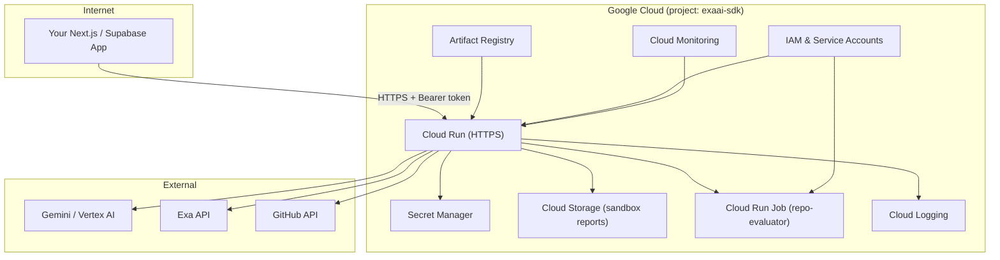

# Deploying EXAai-ADK on Google Cloud — Safe Production Guide

> [!IMPORTANT]
> This guide covers deploying the resume screening API on **Google Cloud Run** with proper secret management, IAM least-privilege, networking, and monitoring. It assumes GCP project `exaai-sdk` (or your own project ID).

---

## Architecture Overview



---

## Step-by-Step Deployment

### 1. Prerequisites

```bash
# Install & configure gcloud CLI
gcloud auth login
gcloud config set project exaai-sdk
gcloud config set run/region asia-south1

# Enable required APIs
gcloud services enable \
  run.googleapis.com \
  artifactregistry.googleapis.com \
  secretmanager.googleapis.com \
  cloudbuild.googleapis.com \
  storage.googleapis.com \
  aiplatform.googleapis.com
```

---

### 2. Create a Dedicated Service Account (Least Privilege)

> [!CAUTION]
> **Never** deploy with a user account or the default Compute Engine service account. Create a purpose-built SA with minimal permissions.

```bash
# Create the service account
gcloud iam service-accounts create exaai-adk-runner \
  --display-name="EXAai-ADK Cloud Run Service"

SA_EMAIL="exaai-adk-runner@exaai-sdk.iam.gserviceaccount.com"

# Grant ONLY the roles it needs:

# 1. Read secrets
gcloud projects add-iam-policy-binding exaai-sdk \
  --member="serviceAccount:$SA_EMAIL" \
  --role="roles/secretmanager.secretAccessor"

# 2. Write sandbox reports to GCS
gcloud projects add-iam-policy-binding exaai-sdk \
  --member="serviceAccount:$SA_EMAIL" \
  --role="roles/storage.objectUser" \
  --condition='expression=resource.name.startsWith("projects/_/buckets/exaai-sdk-manav-reports"),title=SandboxBucketOnly'

# 3. Invoke Cloud Run sandbox jobs
gcloud projects add-iam-policy-binding exaai-sdk \
  --member="serviceAccount:$SA_EMAIL" \
  --role="roles/run.developer"

# 4. (If using Vertex AI instead of API key) — Vertex AI User
gcloud projects add-iam-policy-binding exaai-sdk \
  --member="serviceAccount:$SA_EMAIL" \
  --role="roles/aiplatform.user"

# 5. Write logs
gcloud projects add-iam-policy-binding exaai-sdk \
  --member="serviceAccount:$SA_EMAIL" \
  --role="roles/logging.logWriter"
```

---

### 3. Store Secrets in Secret Manager

> [!WARNING]
> **Never** bake API keys into your Docker image, pass them as plain env vars in `gcloud run deploy`, or commit them to `.env`. Use Secret Manager.

```bash
# Create each secret
echo -n "your-gemini-api-key"      | gcloud secrets create GEMINI_API_KEY --data-file=-
echo -n "your-exa-api-key"         | gcloud secrets create EXA_API_KEY --data-file=-
echo -n "your-github-token"        | gcloud secrets create GITHUB_TOKEN --data-file=-
echo -n "your-groq-api-key"        | gcloud secrets create GROQ_API_KEY --data-file=-
echo -n "your-openrouter-api-key"  | gcloud secrets create OPEN_ROUTER_API_KEY --data-file=-

# Strong, random API key for YOUR clients to authenticate against /screen
API_KEY=$(openssl rand -base64 32)
echo -n "$API_KEY"                 | gcloud secrets create API_KEYS --data-file=-
echo "Save this client API key: $API_KEY"

# Grant the SA access to read these secrets
for SECRET in GEMINI_API_KEY EXA_API_KEY GITHUB_TOKEN GROQ_API_KEY OPEN_ROUTER_API_KEY API_KEYS; do
  gcloud secrets add-iam-policy-binding $SECRET \
    --member="serviceAccount:$SA_EMAIL" \
    --role="roles/secretmanager.secretAccessor"
done
```

---

### 4. Create Artifact Registry Repository

```bash
gcloud artifacts repositories create exaai-adk \
  --repository-format=docker \
  --location=asia-south1 \
  --description="EXAai-ADK container images"
```

---

### 5. Build & Push the Docker Image

```bash
# Authenticate Docker to Artifact Registry
gcloud auth configure-docker asia-south1-docker.pkg.dev

# Build the image (from the project root)
IMAGE="asia-south1-docker.pkg.dev/exaai-sdk/exaai-adk/api:$(git rev-parse --short HEAD)"

docker build -t $IMAGE .
docker push $IMAGE
```

> [!TIP]
> Alternatively, use **Cloud Build** for CI/CD (no local Docker needed):
> ```bash
> gcloud builds submit --tag $IMAGE .
> ```

---

### 6. Create the GCS Bucket for Sandbox Reports

```bash
gcloud storage buckets create gs://exaai-sdk-manav-reports \
  --location=asia-south1 \
  --uniform-bucket-level-access \
  --public-access-prevention

# Enable lifecycle to auto-delete stale reports (e.g., 30 days)
cat <<EOF > /tmp/lifecycle.json
{
  "rule": [{
    "action": {"type": "Delete"},
    "condition": {"age": 30}
  }]
}
EOF
gcloud storage buckets update gs://exaai-sdk-manav-reports \
  --lifecycle-file=/tmp/lifecycle.json
```

---

### 7. Deploy to Cloud Run

```bash
IMAGE="asia-south1-docker.pkg.dev/exaai-sdk/exaai-adk/api:$(git rev-parse --short HEAD)"
SA_EMAIL="exaai-adk-runner@exaai-sdk.iam.gserviceaccount.com"

gcloud run deploy exaai-adk \
  --image=$IMAGE \
  --region=asia-south1 \
  --service-account=$SA_EMAIL \
  --platform=managed \
  --port=8080 \
  --memory=2Gi \
  --cpu=2 \
  --timeout=300 \
  --concurrency=10 \
  --min-instances=0 \
  --max-instances=5 \
  --no-allow-unauthenticated \
  --set-env-vars="SCREENING_MODE=agent,\
LLM_PROVIDER=auto,\
GEMINI_MODEL_ID=gemini-2.5-flash,\
GEMINI_USE_VERTEXAI=false,\
GCP_PROJECT_ID=exaai-sdk,\
GCP_REGION=asia-south1,\
SANDBOX_PROVIDER=cloud_run,\
CLOUD_RUN_SANDBOX_JOB_NAME=repo-evaluator,\
SANDBOX_REPORT_BUCKET=exaai-sdk-manav-reports,\
SANDBOX_REPORT_PREFIX=sandbox-reports,\
SANDBOX_NETWORK_MODE=install_only,\
LOG_LEVEL=INFO,\
LOG_FORMAT=json" \
  --set-secrets="\
GEMINI_API_KEY=GEMINI_API_KEY:latest,\
EXA_API_KEY=EXA_API_KEY:latest,\
GITHUB_TOKEN=GITHUB_TOKEN:latest,\
API_KEYS=API_KEYS:latest,\
GROQ_API_KEY=GROQ_API_KEY:latest,\
OPEN_ROUTER_API_KEY=OPEN_ROUTER_API_KEY:latest"
```

> [!NOTE]
> **Key flags explained:**
> - `--no-allow-unauthenticated` — requires IAM or service-to-service auth to invoke the Cloud Run service (defense in depth on top of your `API_KEYS` Bearer auth).
> - `--set-secrets` — mounts secrets as env vars at runtime; they never appear in the image or deployment metadata.
> - `--timeout=300` — matches `SANDBOX_TIMEOUT_SECONDS` for long screening runs.
> - `--concurrency=10` — each request is CPU/memory intensive (LLM calls, PDF parsing).

---

### 8. Networking & Ingress Security

#### Option A: Internal-only (recommended if your Next.js app also runs on GCP)

```bash
gcloud run services update exaai-adk \
  --region=asia-south1 \
  --ingress=internal
```

Your calling service authenticates via its own SA with `roles/run.invoker`.

#### Option B: External with IAM + API key auth (if calling from outside GCP)

```bash
gcloud run services update exaai-adk \
  --region=asia-south1 \
  --ingress=all

# Grant your calling service's SA permission to invoke
gcloud run services add-iam-policy-binding exaai-adk \
  --region=asia-south1 \
  --member="serviceAccount:your-caller-sa@your-project.iam.gserviceaccount.com" \
  --role="roles/run.invoker"
```

The caller sends both:
1. An **OIDC identity token** (for Cloud Run's IAM gate)
2. A **Bearer API key** in the `Authorization` header (for your app's `api/auth.py` middleware)

#### Option C: External behind Cloud Armor + Load Balancer

For public-facing deployments with WAF, rate limiting, and DDoS protection:

```bash
# Create a serverless NEG
gcloud compute network-endpoint-groups create exaai-neg \
  --region=asia-south1 \
  --network-endpoint-type=serverless \
  --cloud-run-service=exaai-adk

# Create backend service with Cloud Armor
gcloud compute backend-services create exaai-backend \
  --global \
  --load-balancing-scheme=EXTERNAL_MANAGED

gcloud compute backend-services add-backend exaai-backend \
  --global \
  --network-endpoint-group=exaai-neg \
  --network-endpoint-group-region=asia-south1

# Attach a Cloud Armor security policy
gcloud compute security-policies create exaai-waf \
  --description="WAF for EXAai-ADK"

# Rate limit: max 30 requests/minute per IP
gcloud compute security-policies rules create 1000 \
  --security-policy=exaai-waf \
  --expression="true" \
  --action=throttle \
  --rate-limit-threshold-count=30 \
  --rate-limit-threshold-interval-sec=60 \
  --conform-action=allow \
  --exceed-action=deny-429

gcloud compute backend-services update exaai-backend \
  --global \
  --security-policy=exaai-waf
```

---

### 9. Using Vertex AI Instead of API Key (Optional but Recommended for Production)

Vertex AI eliminates the need for a `GEMINI_API_KEY` — the service account authenticates via IAM.

```bash
gcloud run services update exaai-adk \
  --region=asia-south1 \
  --update-env-vars="GEMINI_USE_VERTEXAI=true,VERTEX_GCP_PROJECT_ID=exaai-sdk" \
  --remove-env-vars="GEMINI_API_KEY" \
  --update-secrets="GEMINI_API_KEY=-"
```

The code in `agent/gcp_credentials.py` and `agent/config.py` already supports this — it falls back to Application Default Credentials (ADC) when `GEMINI_USE_VERTEXAI=true`.

---

### 10. Monitoring, Logging & Alerts

```bash
# Structured JSON logs are already handled by the app (LOG_FORMAT=json)
# View logs:
gcloud logging read "resource.type=cloud_run_revision AND resource.labels.service_name=exaai-adk" \
  --limit=50 --format=json

# Create an uptime check
gcloud monitoring uptime create exaai-health \
  --display-name="EXAai-ADK Health" \
  --monitored-resource-type=cloud_run_revision \
  --cloud-run-service-name=exaai-adk \
  --cloud-run-service-region=asia-south1 \
  --path="/health" \
  --period=300

# Alert on high error rates (>5% 5xx in 5 min)
# Create via Console: Monitoring → Alerting → Create Policy
# Condition: Cloud Run → Request count, filter status>=500, ratio > 0.05
```

---

### 11. CI/CD with Cloud Build (Recommended)

Create a `cloudbuild.yaml` in the project root:

```yaml
# cloudbuild.yaml
steps:
  # Run tests
  - name: 'python:3.12-slim'
    entrypoint: 'bash'
    args:
      - '-c'
      - |
        pip install -e ".[dev]"
        python -m spacy download en_core_web_sm
        pytest tests/unit/ -x --tb=short

  # Build container
  - name: 'gcr.io/cloud-builders/docker'
    args:
      - 'build'
      - '-t'
      - '${_IMAGE}'
      - '.'

  # Push to Artifact Registry
  - name: 'gcr.io/cloud-builders/docker'
    args: ['push', '${_IMAGE}']

  # Deploy to Cloud Run
  - name: 'gcr.io/google.com/cloudsdktool/cloud-sdk'
    entrypoint: 'gcloud'
    args:
      - 'run'
      - 'deploy'
      - 'exaai-adk'
      - '--image=${_IMAGE}'
      - '--region=asia-south1'
      - '--service-account=exaai-adk-runner@exaai-sdk.iam.gserviceaccount.com'
      - '--platform=managed'

substitutions:
  _IMAGE: 'asia-south1-docker.pkg.dev/exaai-sdk/exaai-adk/api:${SHORT_SHA}'

images:
  - '${_IMAGE}'
```

Connect to GitHub for automatic deployments:
```bash
gcloud builds triggers create github \
  --repo-name=ExAai-SDK-resume-parser \
  --repo-owner=Manavv007 \
  --branch-pattern="^main$" \
  --build-config=cloudbuild.yaml
```

---

## Security Checklist

| Category | Requirement | Status |
|----------|-------------|--------|
| **Secrets** | All API keys in Secret Manager, not env vars or `.env` | ⬜ |
| **IAM** | Dedicated SA with least-privilege roles | ⬜ |
| **Auth** | `--no-allow-unauthenticated` on Cloud Run | ⬜ |
| **Auth** | Strong, random `API_KEYS` (not `dev-local-key-change-me`) | ⬜ |
| **Network** | Ingress set to `internal` or behind Cloud Armor | ⬜ |
| **Image** | Non-root user in Dockerfile (`appuser`, UID 10001) | ✅ Already done |
| **Image** | Healthcheck configured in Dockerfile | ✅ Already done |
| **PII** | Presidio PII redaction enabled | ✅ Already done |
| **SSRF** | SSRF guard on URL fetching | ✅ Already done |
| **Logging** | Structured JSON logs with `LOG_FORMAT=json` | ⬜ |
| **Monitoring** | Uptime checks and error-rate alerts | ⬜ |
| **Rotation** | Secret versions rotatable without redeployment | ⬜ |
| **GCS** | Public access prevention on report bucket | ⬜ |
| **Sandbox** | Network mode `install_only` (not `always`) | ⬜ |

---

## Quick Reference: Environment Variable Sources

| Variable | Source | Notes |
|----------|--------|-------|
| `GEMINI_API_KEY` | Secret Manager | Or omit if using Vertex AI |
| `EXA_API_KEY` | Secret Manager | Required for profile enrichment |
| `GITHUB_TOKEN` | Secret Manager | Required for repo analysis |
| `API_KEYS` | Secret Manager | Client auth tokens |
| `GROQ_API_KEY` | Secret Manager | Optional (LLM_PROVIDER=auto) |
| `OPEN_ROUTER_API_KEY` | Secret Manager | Optional (LLM_PROVIDER=auto) |
| `SCREENING_MODE` | Plain env var | `agent` or `pipeline` |
| `GCP_PROJECT_ID` | Plain env var | Non-sensitive |
| `GCP_REGION` | Plain env var | Non-sensitive |
| `SANDBOX_REPORT_BUCKET` | Plain env var | Non-sensitive |
| All others | Plain env var | Non-sensitive config |

---

## Cost Optimization Tips

> [!TIP]
> - Set `--min-instances=0` to scale to zero when idle (no cost when not screening)
> - Use `GEMINI_MODEL_ID=gemini-2.5-flash` (cheaper than pro) — already your default
> - Set `JD_PARSE_USE_LLM=false` to save one Gemini call per screen — already your default
> - GCS lifecycle policy auto-deletes sandbox reports after 30 days
> - Use `--concurrency=10` to handle multiple requests per instance (reduces cold starts)
