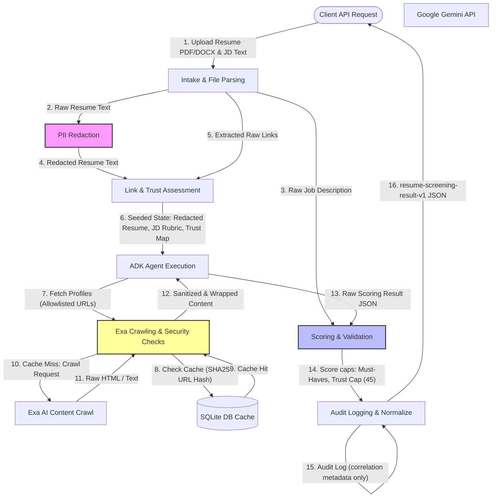
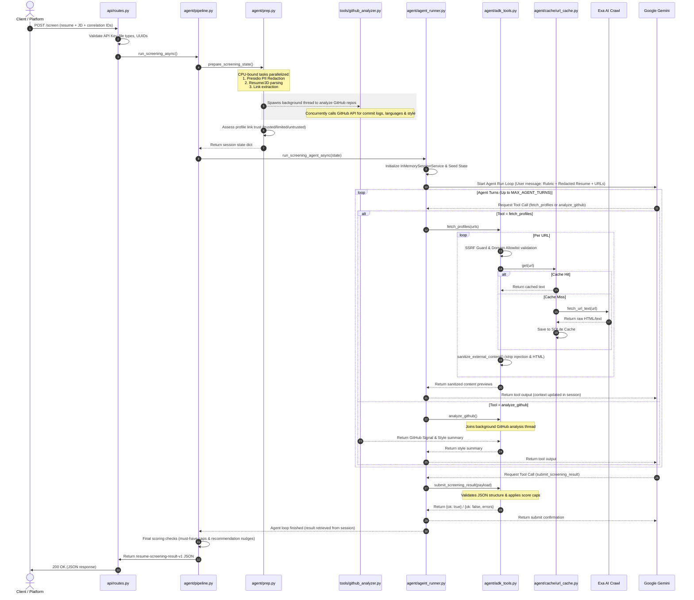

# EXAai-ADK — System Architecture & Diagrammatic Documentation

This document provides a comprehensive breakdown of the **EXAai-ADK** standalone resume screening service. It includes details on the system's design, component boundaries, chronological sequence, data flow, deployment mechanics, and strict security layer.

---

## 1. High-Level Architecture Diagram

The system is structured as a two-layer application: a **Deterministic Prep Layer** in pure Python that runs in parallel for speed, and an **Agentic/Pipeline Scoring Layer** powered by Google Agent Development Kit (ADK) and Gemini.

```mermaid
graph TB
    subgraph Client / Platform
        Client[Client / Main Hiring App]
    end

    subgraph API Entry Point (FastAPI)
        Router[api/routes.py]
        Auth[api/auth.py]
        FileVal[api/file_validation.py]
    end

    subgraph Deterministic Prep Layer (agent/prep.py)
        Parser[tools/parser.py]
        PII[security/pii_redactor.py]
        LinkExt[tools/link_extractor.py]
        TrustAss[security/profile_identity.py]
        Rubric[tools/rubric_builder.py]
    end

    subgraph Agentic Scoring Layer (Google ADK & Gemini)
        Runner[agent/agent_runner.py]
        Agent[Agent: resume_screener]
        T_Urls[list_candidate_profile_urls]
        T_Fetch[fetch_profiles]
        T_Github[analyze_github]
        T_Submit[submit_screening_result]
    end

    subgraph External APIs & Services
        ExaAPI[Exa AI Crawl API]
        GeminiAPI[Google Gemini API]
        GithubAPI[GitHub GraphQL/REST API]
    end

    subgraph Security & Cache Guards
        SSRF[security/ssrf_guard.py]
        Allowlist[security/allowlist.py]
        Sanitizer[tools/sanitizer.py]
        Cache[(cache/url_cache.py - SQLite)]
    end

    subgraph Output & Audit
        Val[tools/validator.py]
        Scorer[tools/scorer.py]
        Audit[audit/logger.py]
    end

    %% Client Interactions
    Client -- "POST /screen (Multipart Form)" --> Router
    Router --> Auth & FileVal
    
    %% API to Prep Layer
    Router -- "run_screening_async()" --> Parser
    Parser -- "Raw text" --> PII & LinkExt
    Parser -- "Raw JD" --> Rubric
    
    %% Background Thread
    LinkExt -- "GitHub Username" --> GithubAPI
    
    %% Identity & Trust
    LinkExt & PII -- "Raw Resume & Link Meta" --> TrustAss
    
    %% Agent Runner Loop
    TrustAss -- "Seeded Session State" --> Runner
    Runner --> Agent
    
    %% Tools Registered
    Agent --> T_Urls
    Agent --> T_Fetch
    Agent --> T_Github
    Agent --> T_Submit
    
    %% Tool Implementations & Security
    T_Fetch --> SSRF --> Allowlist --> Cache
    Cache -- "Cache Miss" --> ExaAPI
    ExaAPI & Cache --> Sanitizer
    Sanitizer -- "Sanitized context" --> Agent
    T_Github -- "Concurrently Analyzes Repos" --> GithubAPI
    
    %% Verdict submission
    T_Submit --> Scorer --> Val
    Val -- "Validation Fail: prompt retry" --> Agent
    Val -- "Success" --> Audit
    Audit --> Router --> Client
```

### Architectural Component Breakdown

1. **FastAPI Web Shell (`api/`)**: Intake router handling HTTP multipart form validation, API-key authentication against a configured allowlist, and formatting safety errors.
2. **Deterministic Prep Layer (`agent/prep.py`)**: Parallelized via a `ThreadPoolExecutor` to execute I/O-bound parsing (via `pdfplumber` or `python-docx`) and CPU-bound PII redaction (via Microsoft Presidio) concurrently. It extracts profile links, builds scoring rubrics from JDs, and executes a background thread for deep GitHub analysis.
3. **Agent & Runner Core (`agent/agent_runner.py`)**: Initializes a single-agent orchestrator utilizing Google ADK. The agent is context-seeded with the redacted resume and structured JD. It executes a maximum of `MAX_AGENT_TURNS` (default 8), calling tools as needed to fetch profile content or trigger repo audits.
4. **Safety & Security Layer (`agent/security/`)**: Validates every outgoing URL using an SSRF guard (blocking private IPs, localhost, non-HTTPS protocols) and matching against an allowlist of permitted portfolio, coding, and academic platforms. It also corroborates names/emails to assign trust tiers.
5. **Data Tier (`agent/cache/`)**: Consists of a SQLite-backed TTL content cache (`url_cache.py`) that stores crawled URL texts, minimizing external Exa calls and ensuring high performance during repeated screenings.

---

## 2. Detailed Data Flow Diagram (DFD)

The Data Flow Diagram charts the movement and transformation of data through the system, highlighting where PII is scrubbed, how external crawling is gated, and where scoring caps are applied.



### Data Transformation Stages

- **Stage 1 (Raw Input)**: Client submits multipart parameters (`application_id`, `job_id`, `resume` file, `jd_text`).
- **Stage 2 (Redacted & Tokenized State)**: Microsoft Presidio scans the resume text. Direct identifiers (names, emails, phones, locations, ages) are replaced with semantic tags (`[PERSON_1]`, `[EMAIL_1]`). Parallelly, name and email tokens are gathered to build a candidate identity index.
- **Stage 3 (Trust Map Generation)**: Extracted profile URLs are parsed for username handles and compared against the identity index. Based on the closeness of match, URLs are mapped to trust levels (`scoring_trusted`, `scoring_limited`, `scoring_untrusted`). Mismatches flag a `profile_identity_mismatch` and trigger score capping.
- **Stage 4 (Crawl Sanitization)**: Raw page crawls returned by Exa are stripped of script/HTML tags, scanned via regex for prompt injection phrases (e.g. *"ignore previous instructions"*), truncated to `CONTENT_TOKEN_CAP` (default 8000), and packed inside strict delimiter tags.
- **Stage 5 (Scored Verdict)**: The ADK agent generates a structured JSON result. Normalization scripts calculate score overrides (e.g. capping overall score at 40 if must-haves fail, capping at 45 if untrusted profiles are present). A JSON Schema validator executes a final schema compliance check.

---

## 3. Sequence Diagram

This sequence diagram depicts the end-to-end execution of a screening request under the default `SCREENING_MODE=agent` path.



---

## 4. Deployment Diagram

The application is deployed as a stateless containerized service. It operates independently of Cloud Service Provider databases (e.g. no direct GCP/Supabase dependency) and communicates solely via secure HTTP REST APIs.

```mermaid
graph TD
    subgraph Client Application Environment
        MainApp[Next.js Web Server]
        Supa[(Supabase Database)]
    end

    subgraph Container Host (Virtual VM / Container Instance)
        subgraph Docker Container
            Uvi[Uvicorn Server - Port 8080]
            App[FastAPI application]
            Cache[(SQLite URL Cache DB - Persistent Mount)]
        end
    end

    subgraph SaaS API Endpoints
        Gemini[Google Gemini API]
        Exa[Exa AI Crawl API]
        GitHub[GitHub API]
    end

    %% Networking
    MainApp -- "HTTP POST /screen (Bearer Auth)" --> Uvi
    MainApp -- "Reads/Writes Status" --> Supa
    Uvi --> App
    App -- "Reads/Writes Cache" --> Cache
    
    %% Outbound connections
    App -- "HTTPS (port 443)" --> Gemini
    App -- "HTTPS (port 443)" --> Exa
    App -- "HTTPS (port 443)" --> GitHub
```

### Deployment Configuration Checklist

- **Stateless Scaling**: Multiple instances of the Docker container can be scaled behind a load balancer since session state is short-lived and tied to the execution lifetime of each request.
- **Persistent Cache Mount**: To preserve cached URL crawls across container recycles, mount a persistent volume at the SQLite DB location (`sqlite:///data/url_cache.db`).
- **Required Secrets (Environment Variables)**:
  - `GEMINI_API_KEY`: API authentication for Gemini.
  - `EXA_API_KEY`: API authentication for Exa AI crawls.
  - `API_KEYS`: Comma-separated authentication tokens for inbound REST API clients.
  - `SCREENING_MODE`: Set to `agent` (default) or `pipeline` (deterministic fallback).

---

## 5. Security & Safety Layer Deep-Dive

Security is a non-negotiable component of the architecture, sitting between the candidate-submitted content and outbound network layers.

### 5.1 PII Redaction
The **Presidio-based PII Redactor** (`agent/security/pii_redactor.py`) operates as a lock-gate prior to the LLM. 
- It screens for: `PERSON`, `EMAIL_ADDRESS`, `PHONE_NUMBER`, `LOCATION`, `DATE_TIME`, `URL` (body text), `NRP`, `AGE`.
- When an entity is detected, it is replaced with a numbered token (e.g., `[PERSON_1]`).
- Overlapping entities are resolved using priority indices (e.g. an email address embedded within a URL string resolves in favor of `EMAIL_ADDRESS` rather than `URL`).
- All redacts are cached using the SHA-256 hash of the input text to prevent redundant processing.

### 5.2 SSRF Guard
Before the Exa crawler initiates any HTTP query, the target URL undergoes validation in `agent/security/ssrf_guard.py`:
1. **Scheme Validation**: Enforces `https` exclusively.
2. **Length Cap**: Limits total characters to 2048 to prevent buffer overflows or memory issues.
3. **Hostname Parsing**: Blocks local loops (`localhost`, `.localhost` subdomains) and literal IP inputs.
4. **DNS Resolution Verification**: Performs DNS resolution and validates that *none* of the resolved IPs fall into loopback, link-local, private, multicast, or reserved ranges (`ipaddress` evaluation).
5. **DNS Cache**: Includes a 60-second in-memory DNS cache to speed up repeated queries of the same host.

### 5.3 Domain Allowlist
Even if a URL passes SSRF checks, the system restricts crawls to pre-approved platform categories (`agent/security/allowlist.py`):
- **Portfolio**: `behance.net`, `dribbble.com`, `webflow.io`, etc.
- **Coding**: `github.com`, `gitlab.com`, `kaggle.com`, `huggingface.co`, `npmjs.com`, etc.
- **Academic**: `scholar.google.com`, `researchgate.net`, `orcid.org`, `arxiv.org`, etc.
- **Certification**: `credly.com`, `coursera.org`, etc.

Any URL not matching this suffix index is skipped. The status is reported as `domain_not_allowlisted` in audit logs, preventing outbound calls to arbitrary blogs, forums, or untrusted pages.

### 5.4 Profile Identity Verification (Tiers & Score Caps)
To prevent candidates from submitting arbitrary high-value links (e.g. pasting Linus Torvalds' GitHub URL on a basic resume), the system implements an identity corroboration process (`agent/security/profile_identity.py`):

```
                       ┌─────────────────────────┐
                       │   Extract Identity      │
                       │   Tokens from Resume:   │
                       │   - Name (Presidio)     │
                       │   - Email prefix        │
                       └────────────┬────────────┘
                                    │
                                    ▼
                       ┌─────────────────────────┐
                       │ Parse username handles  │
                       │ from extracted URL path │
                       └────────────┬────────────┘
                                    │
                                    ▼
                     /─────────────────────────────\
                    / Does username match identity  \
                   <      or cross-linked URLs?      >
                    \                               /
                     \──────────────┬──────────────/
                                    │
                       ┌────────────┴────────────┐
                       │                         │
                    Yes│                       No│
                       ▼                         ▼
            ┌─────────────────────┐   ┌─────────────────────┐
            │   SCORING_TRUSTED   │   │  SCORING_UNTRUSTED  │
            │                     │   │                     │
            │  - Full Exa crawl   │   │  - Skip Exa crawl   │
            │  - High score value │   │  - Cap overall      │
            │                     │   │    score at 45      │
            └─────────────────────┘   └─────────────────────┘
```

- **scoring_trusted**: Profile username handle matches the candidate's name or email tokens. Full crawl details are sent to the LLM judge.
- **scoring_limited**: Profile cannot be definitively corroborated, but represents an explicit resume link. Crawl content is withheld or marked for validation against resume claims.
- **scoring_untrusted**: Direct conflict in identity (different name/email tokens). **Crawl is skipped entirely**. The system logs an `identity_red_flag` (`profile_identity_mismatch`) and caps the final overall `resume_similarity_score` at **45**.

---

## 6. Google ADK Agentic vs Legacy Pipeline Mode

The service supports two processing modes toggleable via the `SCREENING_MODE` environment variable.

| Metric / Flow | Agentic Mode (`agent` - Default) | Pipeline Mode (`pipeline` - Legacy) |
| :--- | :--- | :--- |
| **Orchestrator** | Google ADK Runner + Screening Agent | Sequential Python script pipeline |
| **Exa AI Crawling** | Dynamic and selective. The agent decides which allowlisted URLs to fetch based on rubric relevance. | Bulk enrichment. All candidate URLs are crawled concurrently before the LLM evaluates the profile. |
| **Model Footprint** | Multi-turn interaction (Up to `MAX_AGENT_TURNS`, typically 2–3 turns). | Single model call for evaluation. |
| **Validation Handling** | Tool-driven validation. If Gemini submits bad JSON, the tool returns validation errors, allowing Gemini to correct the payload. | Handled via structured retry loops. If validation fails twice, a static failure payload is returned. |
| **Cost Profile** | Lower Exa AI crawling costs (skips low-signal URLs); slightly higher LLM input/output token cost. | Higher Exa AI crawling cost; lower LLM execution costs. |
