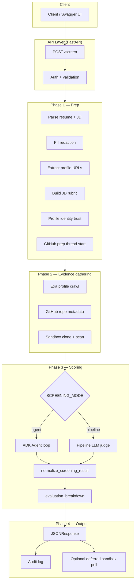
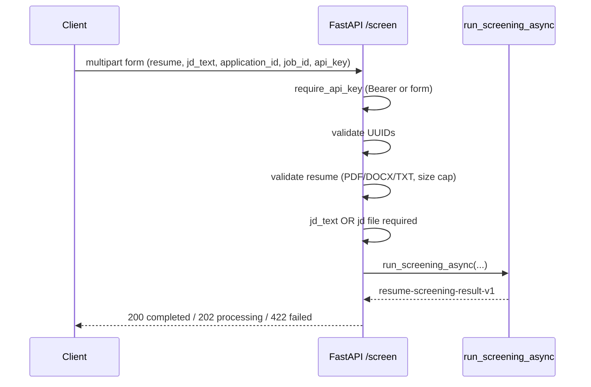
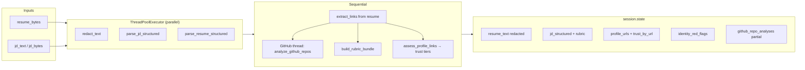
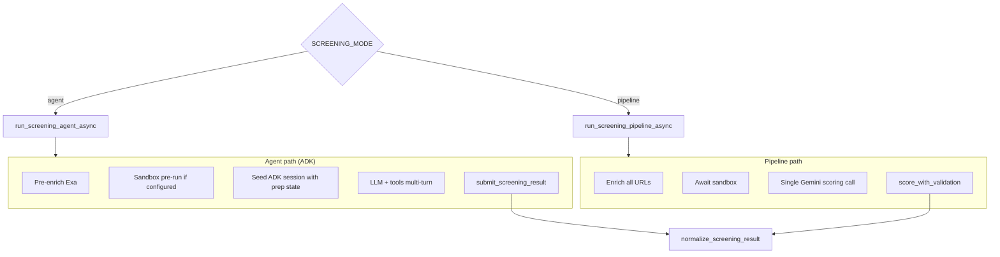
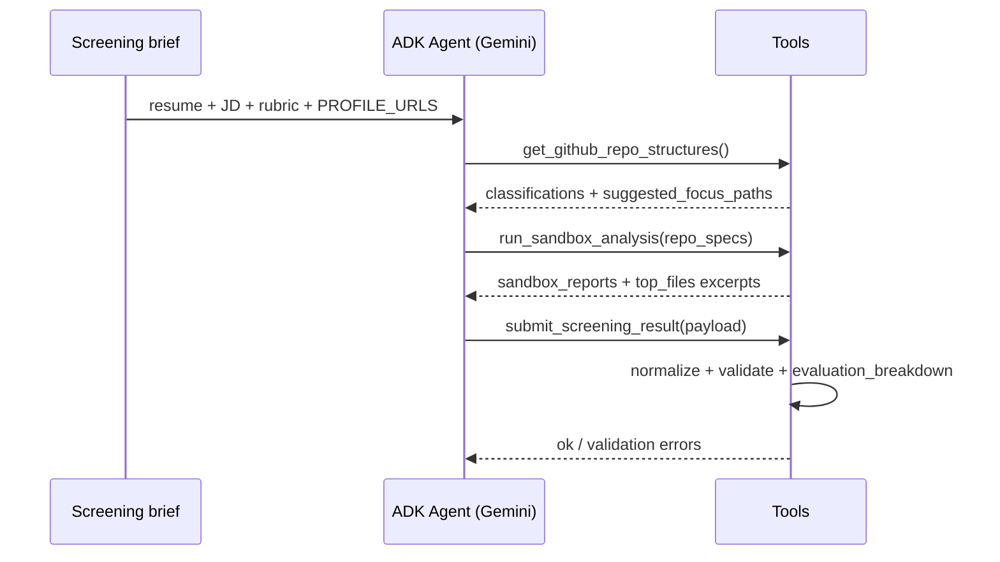
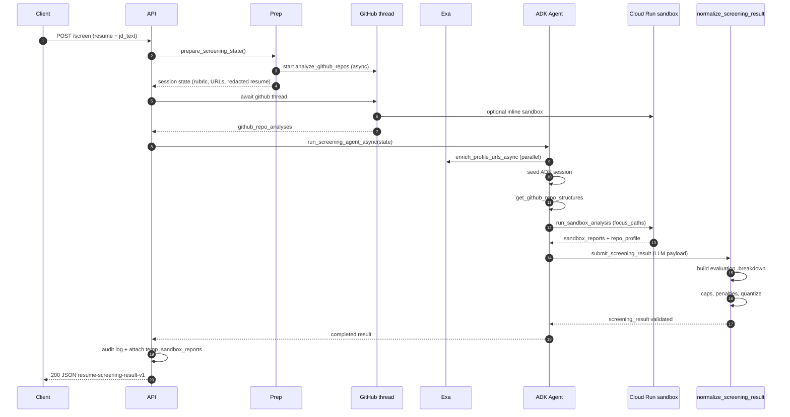

# EXAai-ADK — End-to-End Screening Flow

This document explains how a resume and job description travel through EXAai-ADK from `POST /screen` to the final JSON response. It reflects the current architecture: **prep**, **Exa enrichment**, **GitHub + Cloud Run sandbox**, **ADK agent orchestration** (default), and **deterministic evaluation metrics** (`evaluation_breakdown`).

**Related code:** [`api/routes.py`](api/routes.py) · [`agent/pipeline.py`](agent/pipeline.py) · [`agent/prep.py`](agent/prep.py) · [`agent/agent_runner.py`](agent/agent_runner.py) · [`agent/tools/scorer.py`](agent/tools/scorer.py) · [`agent/tools/repo_scoring.py`](agent/tools/repo_scoring.py)

---

## Table of contents

1. [High-level overview](#1-high-level-overview)
2. [API intake](#2-api-intake)
3. [Prep phase](#3-prep-phase)
4. [GitHub analysis (background)](#4-github-analysis-background)
5. [Enrichment — Exa AI](#5-enrichment--exa-ai)
6. [Screening modes: agent vs pipeline](#6-screening-modes-agent-vs-pipeline)
7. [Sandbox evaluation (Cloud Run)](#7-sandbox-evaluation-cloud-run)
8. [Scoring and final evaluation](#8-scoring-and-final-evaluation)
9. [Output contract](#9-output-contract)
10. [Full sequence diagram](#10-full-sequence-diagram)
11. [Configuration reference](#11-configuration-reference)

---

## 1. High-level overview

A single screening request produces a structured hiring verdict: rubric-aligned requirement scores, recommendation, red flags, crawled sources, sandbox reports, and a composite **evaluation breakdown**.



### What happens in one sentence

The server parses and redacts the resume, structures the JD into a rubric, fetches external profile pages (Exa), analyzes GitHub repos (API + optional sandbox clone), lets an **agent** or **pipeline** judge fit against the rubric, then normalizes scores, applies caps/penalties, and returns `resume-screening-result-v1` JSON.

---

## 2. API intake

**Endpoint:** `POST /screen` (`api/routes.py`)



| Input | Required | Purpose |
|--------|----------|---------|
| `resume` | Yes | PDF, DOCX, or plain text |
| `jd_text` or `jd` file | Yes | Job description text |
| `application_id` | Yes | UUID — ties to your applicant record |
| `job_id` | Yes | UUID — ties to your job posting |
| `api_key` | Yes | Must match `API_KEYS` in server `.env` |

Middleware adds `request_id` and timing. Failed auth returns **401**; bad UUIDs or files return **400**.

---

## 3. Prep phase

**Entry:** `prepare_screening_state()` in [`agent/prep.py`](agent/prep.py)

Prep runs **before** any LLM agent turn. It produces a session state dict used by enrichment, tools, and scoring.



### Prep outputs (key fields)

| Field | Description |
|--------|-------------|
| `resume_text` | PII-redacted resume (safe for LLM prompts) |
| `jd_structured` | Parsed title, requirements, must-have / nice-to-have |
| `rubric` | List of criteria with weights (`must_have` ×2 in scoring) |
| `profile_urls` | HTTPS links from resume (GitHub, LinkedIn, portfolio, …) |
| `profile_trust_by_url` | `scoring_trusted` / `scoring_limited` / `scoring_untrusted` |
| `identity_red_flags` | e.g. LinkedIn slug mismatch with resume name |
| `github_username` | Extracted from GitHub URLs |
| `github_repo_analyses` | Filled asynchronously by background GitHub thread |
| `enriched_contents` | Starts `[]` — filled by Exa enrichment |

### JD → rubric

[`agent/tools/rubric_builder.py`](agent/tools/rubric_builder.py) turns structured JD lines into scoring criteria:

- **Must have** / **Required** → `weight: must_have`
- **Preferred** / **Nice to have** / **Bonus** → `weight: nice_to_have`

Each criterion becomes one row in final `requirement_matches[]`.

### Profile identity

[`agent/security/profile_identity.py`](agent/security/profile_identity.py) checks whether profile URLs plausibly belong to the resume identity:

- **Trusted** — may fetch via Exa and use in scoring
- **Limited** — use with caution; content may be withheld in strict mode
- **Untrusted** — never fetch; may cap overall score at **45** and add red flags

---

## 4. GitHub analysis (background)

As soon as links are extracted, prep starts a **background thread** that runs `analyze_github_repos()` while PII redaction and rubric building continue.

```mermaid
flowchart TB
    GH[GitHub REST API] --> Meta[Per-repo metadata]
    Meta --> M1[languages, stars, is_fork]
    Meta --> M2[has_tests, has_ci, has_docker]
    Meta --> M3[code_samples + README snippets]
    Meta --> M4[candidate_tags from JD keywords]

    Meta --> Select[Select sandbox repo URLs]
    Select --> SB{Sandbox enabled?}
    SB -->|yes| CR[Cloud Run repo-evaluator job]
    SB -->|no| Done[github_repo_analyses only]

    CR --> Reports[sandbox_reports[]]
    Reports --> Done
```

**Candidate tags** (e.g. `ai_engineer`, `backend_engineer`) drive repo **classification**: `aligned`, `adjacent`, `peripheral`, `orthogonal`.

The main pipeline **awaits** this thread (`_await_github_prep`) before agent/pipeline scoring starts, so GitHub context is usually ready.

---

## 5. Enrichment — Exa AI

**Module:** [`agent/enrichment.py`](agent/enrichment.py) · **Crawler:** [`agent/tools/crawler.py`](agent/tools/crawler.py)

Exa fetches public text for allowlisted profile URLs (GitHub pages, portfolios, etc.).

```mermaid
flowchart TD
    URLs[profile_urls from resume] --> Gate{SSRF + allowlist + trust}
    Gate -->|blocked| Skip[Record skip / stub]
    Gate -->|ok| Cache{URL cache hit?}
    Cache -->|yes| Hit[Serve cached text]
    Cache -->|no| Exa[Exa get_contents batch API]
    Exa --> San[sanitize_external_content max 8k chars]
    San --> EC[enriched_contents[]]
    Skip --> EC

    EC --> SC[sources_crawled in final JSON]
```

| Mode | When Exa runs |
|------|----------------|
| **Agent** (`AUTO_ENRICH_PROFILES=true`, default) | Automatically **before** agent session — all trusted URLs batch-fetched |
| **Pipeline** | Always via `enrich_profile_urls_async()` before scoring |
| **Agent tool** | Optional `fetch_profiles(urls)` for extra URLs |

Untrusted URLs get a stub entry (no Exa call) but still appear in `sources_crawled` with low relevance.

---

## 6. Screening modes: agent vs pipeline

Controlled by `SCREENING_MODE` in `.env` (default in many deployments: **`agent`**).



### Agent tools (when `AGENT_EVIDENCE_ORCHESTRATION_ENABLED=true`)

| Tool | Role |
|------|------|
| `get_github_repo_structures` | Repo file trees + **classification** + suggested focus paths |
| `fetch_profiles` | Extra Exa fetches (optional if pre-enrich ran) |
| `run_sandbox_analysis` | Clone repos with agent-chosen `focus_paths` (1–5 files/repo) |
| `submit_screening_result` | Final JSON payload → server normalizes |
| `analyze_github` | On-demand if prep GitHub data missing |

### Agent turn workflow (simplified)



If the agent stops early without submitting, the runner sends **continuation nudges** (up to 3) and may fall back to pipeline scoring.

---

## 7. Sandbox evaluation (Cloud Run)

**Provider:** `SANDBOX_PROVIDER=cloud_run` · **Job:** `repo-evaluator` on GCP

```mermaid
flowchart TB
    Spec[repo_specs from agent] --> CR[Cloud Run Job]
    CR --> Clone[git clone repo]
    Clone --> Prof[repo_profiler]

    subgraph Metrics["repo_profile metrics"]
        G[git_profile: commits, authors, recency, merge ratio]
        C[code_metrics: types, complexity, lint, error handling]
        D[documentation_profile: README signals]
        Sec[security_profile: secrets, env files]
        Ext[external_tool_signals: trivy, pip_audit, semgrep, scc]
        TF[top_files: agent-focused code excerpts]
    end

    Prof --> Metrics
    Metrics --> Report[sandbox_reports[]]
    Report --> Class[classification / repo_role]
```

### Repo classification (relevance to JD)

| Label | Meaning | Sandbox penalty weight |
|--------|---------|------------------------|
| `aligned` | Core evidence for the role (e.g. RAG + FastAPI for AI intern JD) | 1.0 |
| `adjacent` | Related but secondary (e.g. automation/n8n alongside main project) | 0.6 |
| `peripheral` | Portfolio / loose tie | 0.2 |
| `orthogonal` | Off-topic for role (e.g. pure frontend for backend JD) | 0.0 |

**Risk signals** (secrets, CVE counts, high findings) apply stricter caps on **aligned** repos. Missing tests/CI on coursework repos are **not** primary penalties.

---

## 8. Scoring and final evaluation

Scoring happens in two layers: **LLM judgment** (rubric + evidence) and **deterministic metrics** (`evaluation_breakdown`).

```mermaid
flowchart TB
    subgraph LLM["Agent / Gemini output"]
        RM[requirement_matches[]]
        RS[resume_similarity_score]
        RF[red_flags[]]
        TFE[top_file_evaluation[]]
    end

    subgraph Deterministic["Server-side (repo_scoring.py)"]
        JD[jd_fit_score from rubric mean]
        PF[repo_portfolio_score per repo]
        CQ[code_quality_score]
        SP[sandbox_penalty + risk ceiling]
        COMP[composite_score]
    end

    RM --> JD
    PF --> COMP
    CQ --> COMP
    JD --> COMP
    SP --> COMP

    COMP --> Final[resume_similarity_score.score]
    JD --> Caps[must-have cap · identity cap · quantize to step 5]
    Caps --> Final
```

### JD fit score

Weighted mean of `requirement_matches[].match_score`:

- `must_have` criteria → weight **2**
- `nice_to_have` → weight **1**

If **no** must-have reaches ≥ 50, overall score is capped at **40**.

### Repo portfolio score (per repo, `clone_ok: true`)

```
ownership_confidence = f(commit share, solo bonus, is_fork cap)
activity_score       = commits + recency + days active
documentation_score  = README + content quality + license
collaborators_score  = collaborators (solo intern → neutral 50)

repo_final = (0.35×activity + 0.40×docs + 0.25×collaborators) × ownership
```

Aggregated across repos weighted by `aligned` / `adjacent` / `peripheral`.

### Code quality score (any repo with code metrics)

Domain-agnostic components (weights sum to 100):

| Component | Weight |
|-----------|--------|
| Type annotations | 10 |
| Error handling | 15 |
| Secrets | 20 |
| Cyclomatic complexity | 15 |
| Lint | 10 |
| Merge hygiene | 10 |
| CI present | 10 |
| Focused file substance | 10 |

**Bonuses only (no penalty if missing):** `has_tests` +3, `has_docker` +2 on aligned/adjacent repos.

### Composite final score

When sandbox repo metrics exist:

```
composite = 0.55 × jd_fit + 0.20 × repo_portfolio + 0.25 × code_quality − sandbox_penalty
```

Subject to **risk ceiling** (e.g. severe aligned-repo secrets → cap ~60–65).

`resume_similarity_score.score` uses **composite** when repo metrics are available; otherwise falls back to LLM/rubric score.

### Sandbox risk penalties (deterministic)

From [`agent/tools/sandbox_scoring.py`](agent/tools/sandbox_scoring.py):

- Weak secret hygiene, secret pattern hits, combined vulnerabilities (pip + trivy + npm)
- Blended penalty: `0.7 × worst_repo + 0.3 × average`, max **40** points off
- Score ceilings on aligned/adjacent severe risk

---

## 9. Output contract

**Schema:** `resume-screening-result-v1` ([`agent/schema/resume-screening-result-v1.json`](agent/schema/resume-screening-result-v1.json))

```mermaid
flowchart LR
    subgraph Required["Always present"]
        ID[application_id, job_id]
        ST[resume_screening_status]
        MD[metadata]
        ER[errors]
    end

    subgraph Completed["When status = completed"]
        SC[resume_similarity_score]
        RM[requirement_matches]
        REC[recommendation + reasoning]
        RF[red_flags]
        SRC[sources_crawled]
    end

    subgraph Extended["Extended fields"]
        TSR[temp_sandbox_reports]
        TFE[top_file_evaluation]
        EV[evaluation_breakdown]
    end

    Required --> Completed
    Completed --> Extended
```



### Example `evaluation_breakdown`

```json
{
  "jd_fit_score": 90,
  "repo_portfolio_score": 74,
  "code_quality_score": 62,
  "sandbox_penalty": 12,
  "composite_score": 72,
  "final_score": 70,
  "final_score_source": "evaluation_composite",
  "blend_weights": { "jd_fit": 0.55, "repo_portfolio": 0.2, "code_quality": 0.25 },
  "repos": [
    {
      "url": "https://github.com/user/project",
      "classification": "aligned",
      "activity_score": 78,
      "documentation_score": 85,
      "code_quality_score": 62,
      "repo_final_score": 67,
      "ownership_confidence": 0.91
    }
  ]
}
```

### Recommendation rules

| Condition | Typical recommendation |
|-----------|------------------------|
| Score ≥ 75 | `advance` (server may upgrade `hold` → `advance`) |
| Score 60–74 | `hold` |
| Score < 60 | `hold` or `reject` |
| Aligned repo CRITICAL risk + weak secrets | Cautious `hold` even if JD fit is high |

---

## 10. Full sequence diagram

End-to-end path for **agent mode** (typical production config):



---

## 11. Configuration reference

| Variable | Typical value | Effect |
|----------|---------------|--------|
| `SCREENING_MODE` | `agent` | ADK tool loop vs single-shot pipeline |
| `LLM_PROVIDER` | `gemini` | Gemini via API key or Vertex |
| `GEMINI_USE_VERTEXAI` | `true` | Use Vertex AI + service account |
| `EXA_API_KEY` | set | Profile URL crawling |
| `AUTO_ENRICH_PROFILES` | `true` | Pre-fetch Exa before agent |
| `AGENT_EVIDENCE_ORCHESTRATION_ENABLED` | `true` | Structure + sandbox tools for agent |
| `SANDBOX_PROVIDER` | `cloud_run` | GCP sandbox jobs |
| `SANDBOX_LLM_SCORING_ENABLED` | `true` | LLM judges sandbox risk (not only deterministic) |
| `GITHUB_CLONE_ANALYSIS_ENABLED` | `true` | Deep GitHub + sandbox selection |
| `SCORING_SCORE_STEP` | `5` | Scores snapped to 0, 5, 10, …, 100 |
| `SCORING_RUBRIC_DERIVED` | `true` | Rubric mean used when no sandbox composite |

---

## Quick reference — file map

| Stage | Primary files |
|-------|----------------|
| HTTP | `api/routes.py`, `api/middleware.py`, `api/auth.py` |
| Orchestration | `agent/pipeline.py` |
| Prep | `agent/prep.py`, `agent/tools/parser.py`, `agent/tools/rubric_builder.py` |
| Exa | `agent/enrichment.py`, `agent/tools/crawler.py` |
| GitHub | `agent/tools/github_analyzer.py` |
| Agent | `agent/agent_runner.py`, `agent/adk_tools.py` |
| Sandbox | `agent/sandbox/`, `agent/tools/repo_focus.py` |
| Scoring | `agent/tools/scorer.py`, `agent/tools/repo_scoring.py`, `agent/tools/sandbox_scoring.py` |
| Submit | `agent/submit.py`, `agent/tools/result_sanitizer.py` |
| Schema | `agent/schema/resume-screening-result-v1.json` |

---

*Last updated to match evaluation_breakdown, auto Exa pre-enrich, and agent-orchestrated sandbox flow.*
